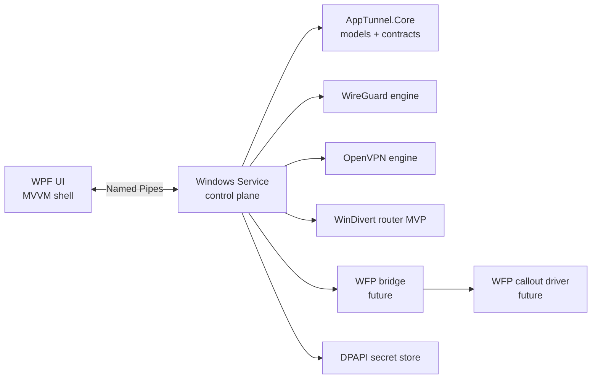

# App Tunnel Architecture

## Topology

## Component responsibilities

### AppTunnel.UI

- Presents configuration, profile assignment, status, and diagnostics views
- Talks only to the service through named pipes
- Never owns driver state or privileged routing logic
- Can run in installer or portable distribution mode

### AppTunnel.Service

- Owns the privileged control plane
- Hosts the named-pipe server and command handlers
- Stores secrets with DPAPI
- Coordinates VPN engine lifecycle and routing backend lifecycle
- Produces structured logs and later assembles export bundles

### AppTunnel.Core

- Holds shared domain models, enums, contracts, and IPC envelopes
- Defines the service control surface seen by both UI and service
- Avoids direct dependencies on WPF, service hosting, or native drivers

### VPN engines

- `ITunnelEngine` provides a stable abstraction for importing and operating profile-based VPN tunnels
- WireGuard is the first real engine target
- OpenVPN remains behind the same interface to prevent UI or service branching logic from hard-coding a provider

### Routing backends

- `IRouterBackend` abstracts app-scoped traffic steering
- `MvpRouter` maps to WinDivert and is appropriate for proving the selective-routing workflow
- `ProdRouter` maps to a WFP callout driver plus a user-mode bridge and is the long-term production path

## Control-plane flow

1. UI sends a named-pipe command such as `Ping` or `GetOverview`.
2. Service deserializes the request and dispatches to `IAppTunnelControlService`.
3. Control service composes state from configured engines, routers, and persisted catalog data.
4. Service returns a typed response envelope to the UI.
5. UI updates the MVVM view model and surfaces health, capabilities, and known gaps.

## Data ownership

- App definitions: executable path now, packaged app identity later
- VPN profiles: imported profile metadata, provider kind, stored config path, secret reference
- Assignments: app-to-profile mapping and future routing policy flags
- Secrets: stored only by the service, protected with DPAPI

## Security boundaries

- UI is unprivileged by design
- Service is the privileged broker for secrets, drivers, and tunnel lifecycle
- Named-pipe ACL hardening is still a TODO and is called out as a known gap
- Portable edition still requires elevation for service/driver installation and cleanup actions

## Planned production architecture

- WFP driver enforces per-flow or per-app classification in kernel mode
- User-mode WFP bridge coordinates policy updates from the service to the driver
- Installer edition owns service registration, driver registration, and upgrade handling
- Portable edition stages binaries in-place, elevates on first run, and uses a cleanup utility to uninstall services and drivers